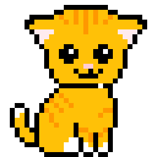
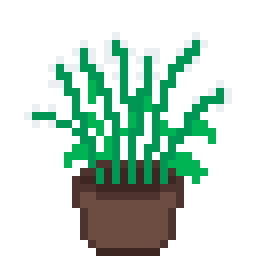
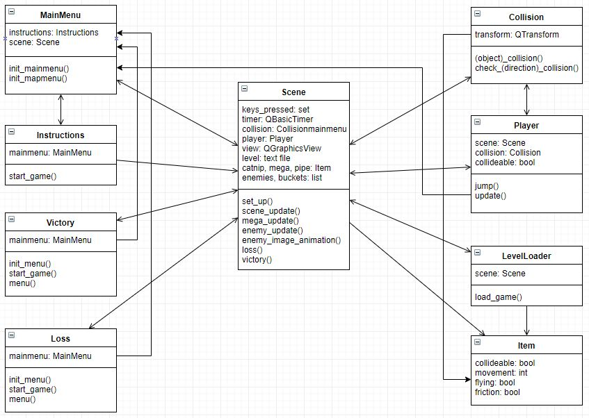
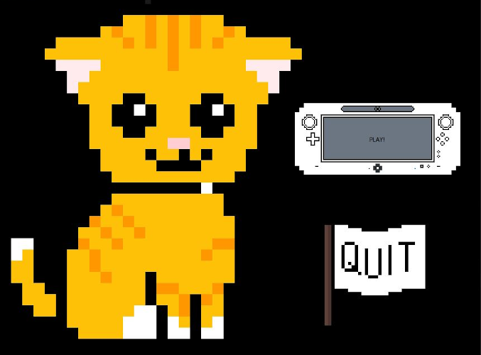

# Catnip Hunt

**Software project for CS-A1121**

 

## Description

Catnip Hunt is a platform game where you explore through various obstacles trying to find catnip
while trying to avoid getting hit by some of cats' worst nightmares; vaccuum cleaners and water.
The game has 4 different maps which can be edited easily with the provided instructions.

## Features

* 2D-graphics and a graphical UI
* Collision detection
* Multiple maps to choose from (easily editable)
* Different kinds of obstacles and enemies
* Self-drawn graphics

## Repository contents

* `doc/`
    * Contains extra documentation of the project (not stated in this file)

* `src/`
    * Contains all the source code and other needed sources (e.g. images and level files)

* `.gitignore`
    * Standard Python .gitignore file with a few additions

* `README.md`
    * This file, contains overview and documentation of the project and repository

## Install dependencies

    pip install pyqt5

## Running the program

    cd src
    python catnip_hunt.py

## Controls

* A/D or <-/-> to move left/right
* Space to jump
* Esc to return to main menu

## Gameplay

* You must find the catnip and reach it
* If you touch the catnip, you win
* Watch out for the water buckets and vaccuum cleaners!
    * If you fall into a bucket, you lose
    * If you git a vaccuum cleaner from below or the sides, you lose
    * You can ride the vaccuum cleaners by standing on top of them!
* If you fall to a pit, you lose

## Implementation details

The assignment was to create a software project (topic: platform game) using Python and Qt (PyQt5).
I used multiple features of Qt to implement my project along with built-in Python features.
This was my first software project so looking back to it shows some design flaws in the structure.
Nonetheless it's an enjoyable game that is fun to play and works fluently.

Sketch of the software structure as a UML chart:

### Images

